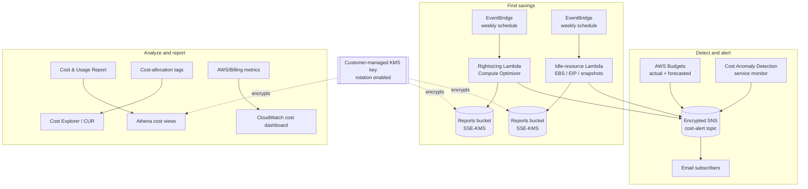

# aws-finops-automation

Cost visibility and optimization for AWS, delivered as Terraform. This project
codifies the guardrails that keep spend predictable — budgets, machine-learning
anomaly detection, rightsizing insight, idle-resource cleanup, cost-allocation
tagging, and dashboards — so financial controls live in version control
alongside the rest of the platform. Everything ships as templates with
placeholder values and is never executed against a real account here.

## Architecture at a glance



Full component walkthrough in [docs/architecture.md](docs/architecture.md);
the operator playbook for acting on findings is in
[docs/savings-runbook.md](docs/savings-runbook.md).

## What this provisions

- **AWS Budgets** — an account-wide monthly cost budget with tiered
  actual-spend thresholds plus a forecasted-overrun alarm, and optional
  per-service budgets for the heaviest line items.
- **Cost Anomaly Detection** — a service-dimensional monitor over the whole
  account with an SNS subscription that fires only once an anomaly clears a
  configurable dollar-impact floor.
- **SNS alerting** — a single encrypted topic that Budgets, Cost Anomaly
  Detection, and both report Lambdas publish to, with email subscriptions and a
  least-privilege topic policy scoped to this account.
- **Rightsizing report** — a scheduled Compute Optimizer Lambda that collects
  EC2, Auto Scaling group, EBS, and Lambda recommendations, estimates monthly
  savings, and delivers a report to S3 and the alert topic. Strictly read-only.
- **Idle-resource finder** — a scheduled Lambda that reports unattached EBS
  volumes, unassociated Elastic IPs, and stale snapshots, skipping anything
  tagged for retention. Reports reclaimable spend without deleting anything.
- **Athena cost views** — SQL views over the Cost and Usage Report for spend
  trends, per-account and per-service breakdowns, and tag allocation.
- **Cost-allocation tagging** — activation of user-defined tag keys as billable
  dimensions in Cost Explorer, Budgets, and the CUR.
- **Cost dashboard** — a CloudWatch dashboard summarizing estimated charges in
  total, over time, and per service.

## Layout

| Path                  | Purpose                                                        |
| --------------------- | -------------------------------------------------------------- |
| `versions.tf`         | Terraform and provider version constraints.                    |
| `providers.tf`        | AWS provider pinned to the cost-management control-plane region. |
| `variables.tf`        | Input variables with validation.                               |
| `budgets.tf`          | Budgets, Cost Anomaly Detection, and the alert SNS topic.      |
| `rightsizing.tf`      | Compute Optimizer report Lambda, report bucket, KMS, schedule. |
| `cleanup.tf`          | Idle-resource finder Lambda, report bucket, and schedule.      |
| `athena.tf`           | Athena workgroup, views database, and CUR cost-view queries.   |
| `allocation.tf`       | Cost-allocation tag activation for user-defined tag keys.      |
| `dashboard.tf`        | CloudWatch dashboard for total, trend, and per-service spend.  |
| `outputs.tf`          | Topic ARN, budget names, anomaly and rightsizing/Athena refs.  |
| `lambda/rightsizing/` | Rightsizing report generator source and its documentation.     |
| `lambda/idle-finder/` | Idle-resource finder source and its documentation.             |
| `athena/`             | CUR cost-view SQL templates.                                   |
| `tests/`              | Pytest suites for both report Lambdas.                         |
| `docs/`               | Architecture and savings runbook.                              |
| `Makefile`            | Validation, deploy, report, and lint entry points.             |

## Configuration

| Variable                          | Default       | Description                                             |
| --------------------------------- | ------------- | ------------------------------------------------------ |
| `cost_management_region`          | `us-east-1`   | Region for the cost-management control plane.          |
| `name_prefix`                     | `finops`      | Prefix for created resource names.                     |
| `monthly_budget_amount`           | `1000`        | Monthly cost ceiling in USD.                           |
| `budget_alert_thresholds_percent` | `[50,80,100]` | Percent-of-budget thresholds that raise an alert.      |
| `service_budgets`                 | `{}`          | Optional per-service monthly budgets.                  |
| `alert_email_addresses`           | `[]`          | Emails subscribed to the alert topic (confirm opt-in). |
| `enable_anomaly_detection`        | `true`        | Toggle the anomaly monitor and subscription.           |
| `anomaly_total_impact_threshold`  | `100`         | Minimum anomaly dollar impact before notifying.        |
| `enable_rightsizing_report`       | `true`        | Toggle the Compute Optimizer report Lambda.            |
| `rightsizing_schedule_expression` | weekly        | EventBridge schedule for the rightsizing report.       |
| `rightsizing_savings_threshold`   | `1`           | Minimum monthly USD savings shown in the report.       |
| `enable_idle_finder`              | `true`        | Toggle the idle-resource finder Lambda.                |
| `idle_finder_schedule_expression` | weekly        | EventBridge schedule for the idle-resource finder.     |
| `stale_snapshot_age_days`         | `90`          | Minimum snapshot age reported as stale.                |
| `idle_exclusion_tag_keys`         | `[finops:keep]` | Tag keys that exempt a resource from the report.     |
| `enable_athena_cost_views`        | `false`       | Register the Athena CUR cost views (needs a CUR table). |
| `cur_database_name` / `cur_table_name` | `null`   | Glue database/table of the Cost and Usage Report.      |
| `cost_allocation_tag_keys`        | `[Project, Environment, Team, CostCenter, Owner]` | Tag keys activated as cost-allocation tags. |
| `enable_cost_dashboard`           | `true`        | Toggle the CloudWatch cost dashboard.                  |
| `dashboard_service_dimensions`    | `[AmazonEC2, AmazonS3, AmazonRDS, AWSLambda, AmazonCloudWatch]` | Services charted on the per-service widget. |

## Quick start

```bash
make init
make validate
terraform plan \
  -var 'monthly_budget_amount=2500' \
  -var 'alert_email_addresses=["finops@example.invalid"]'
make apply
```

> All examples use placeholder values (account id `123456789012`,
> `example.invalid` addresses). Supply your own before applying.

## Savings levers

The controls here surface reclaimable spend across five levers; each is
explained end to end, with the report fields to act on, in
[docs/savings-runbook.md](docs/savings-runbook.md):

- **Right-size over-provisioned compute** from Compute Optimizer findings.
- **Reclaim idle resources** — unattached volumes, unassociated Elastic IPs,
  and stale snapshots.
- **Catch anomalies early** before an unexpected spend pattern compounds.
- **Stay ahead of the budget** with forecasted-overrun alerts.
- **Attribute spend** through cost-allocation tags and Athena views so each
  team owns its share.

## Validation

`make validate` runs `terraform fmt -check`, `init -backend=false`, and
`terraform validate`; `make lint` runs TFLint; `make test` runs the pytest
suites. These mirror the checks enforced in continuous integration.

## Design principles

- **Alerts route through one topic.** Budgets, anomaly detection, and both
  report Lambdas share a single SNS topic, so notification wiring lives in one
  place.
- **Forecast before you overspend.** The highest budget threshold also arms a
  forecasted alarm to warn ahead of an actual overrun.
- **Report, never delete.** The optimization Lambdas are strictly read-only;
  remediation stays a human decision.
- **Least privilege by default.** Each Lambda role is scoped to exactly the
  describe/get calls it needs, and the topic policy only lets AWS
  cost-management services publish, and only from this account.
- **Everything is toggle-able.** Each capability can be turned on or off
  without editing the module.

## License

Released under the [MIT License](LICENSE).
