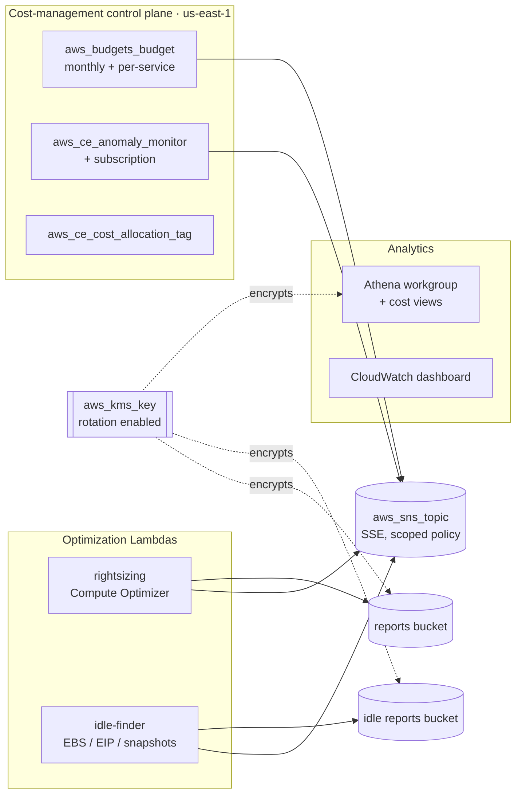

# Architecture

This platform organizes cost control into three planes — **detect and alert**,
**find savings**, and **analyze and report** — that share one encrypted
notification topic and one customer-managed KMS key. Every resource is defined
as Terraform and ships with placeholder values; nothing is executed against a
real account here.

## Component model

## Detect and alert

Two independent signals feed one topic.

`budgets.tf` provisions an account-wide monthly **cost budget** with amortized
cost types and a dynamic notification per configured threshold: each threshold
raises an `ACTUAL`-spend alert, and the highest threshold additionally arms a
`FORECASTED` alarm so an overrun is flagged before it happens. Optional
per-service budgets are stamped out with a `for_each` over `service_budgets`,
each scoped to a Cost Explorer service dimension.

`budgets.tf` also creates the **Cost Anomaly Detection** monitor — a
`DIMENSIONAL` `SERVICE` monitor over the whole account — plus a subscription
whose `threshold_expression` suppresses noise below
`anomaly_total_impact_threshold` dollars. Both the monitor and subscription are
gated on `enable_anomaly_detection`.

The shared **SNS topic** is encrypted with the AWS-managed SNS key and carries
a topic policy that grants `SNS:Publish` only to `budgets.amazonaws.com` and
`costalerts.amazonaws.com`, guarded by an `aws:SourceAccount` condition to block
the confused-deputy pattern. Email subscriptions are created per address in
`alert_email_addresses`; each subscriber confirms an emailed opt-in before
delivery starts. Alerts can also be routed to a pre-existing topic via
`existing_sns_topic_arn`.

## Find savings

Two scheduled, **read-only** Lambdas surface reclaimable spend.

The **rightsizing report** (`rightsizing.tf`, `lambda/rightsizing/`) paginates
Compute Optimizer recommendations for EC2 instances, Auto Scaling groups, EBS
volumes, and Lambda functions, keeps only actionable findings, selects the
requested recommendation rank, filters by a monthly-savings floor, aggregates
per family, and writes a date-partitioned JSON report to S3 (SSE-KMS) plus a
text summary to the alert topic. Each family collector is isolated so a single
API failure cannot sink the run.

The **idle-resource finder** (`cleanup.tf`, `lambda/idle-finder/`) scans three
cost-accruing idle categories — unattached EBS volumes, unassociated Elastic
IPs, and stale EBS snapshots (optionally only those whose source volume is
gone) — attaches an approximate monthly cost from documented, overridable
blended rates, and reports to S3 and the topic. Any resource carrying one of
`idle_exclusion_tag_keys` (default `finops:keep`) is skipped.

Both Lambdas run Python 3.12 with X-Ray active, log to a KMS-encrypted log
group, and are triggered on independent weekly EventBridge schedules. Their IAM
roles grant only the describe/get calls each needs, `s3:PutObject` on its own
bucket, `kms` use on the shared key, and `SNS:Publish` on the alert topic.

## Analyze and report

`athena.tf` (gated on `enable_athena_cost_views`) registers a hardened Athena
results bucket, a workgroup with enforced result encryption, a Glue database
for the views, and a named query per SQL template in `athena/` — spend by
service, daily cost by account, cost by environment tag, and top compute spend
by resource — all built over an existing Cost and Usage Report table.

`allocation.tf` activates the `cost_allocation_tag_keys` as **cost-allocation
tags** so spend can be grouped by `Project`, `Environment`, `Team`, and the
like across Cost Explorer, Budgets, and the CUR. Activation runs in the
management (payer) account and populates once AWS observes each tag on a
billable resource.

`dashboard.tf` (gated on `enable_cost_dashboard`) builds a CloudWatch
**dashboard** over `AWS/Billing` `EstimatedCharges`: a total-charges single
value, a total-charges time series, and a stacked per-service time series across
`dashboard_service_dimensions`. Billing metrics publish only to `us-east-1` — 
the region the provider already targets — and refresh on a multi-hour cadence,
so the widgets read them at a six-hour period with the `Maximum` statistic.

## Shared encryption

A single customer-managed **KMS key** (`rightsizing.tf`) with rotation enabled
encrypts both report buckets, the Lambda log groups, and the Athena results.
The key is created whenever any key-owning feature — rightsizing, the idle
finder, or the Athena views — is enabled, and its policy scopes CloudWatch Logs
usage to the current region.

## Design decisions

- **One topic, many publishers.** Consolidating every cost signal onto one SNS
  topic keeps subscription management in a single place and lets an operator
  add a chat/paging integration once rather than per feature.
- **Report, never remediate.** The optimization Lambdas only describe and get;
  deleting a volume or releasing an address stays an explicit human action,
  documented in the savings runbook. This avoids destructive automation acting
  on a false positive.
- **Suppress low-value noise.** The anomaly subscription and the rightsizing
  report both apply a dollar floor so alerts correspond to spend worth acting
  on.
- **Encrypt everything at rest.** Reports and query results contain account
  spend detail, so all buckets and logs use a rotating customer-managed key.
- **Everything is optional.** Each capability is behind a toggle, so an account
  can adopt budgets first and layer optimization and analytics in later without
  editing the configuration.
